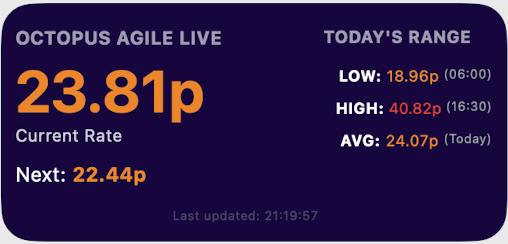

# Octopus Agile Live Widget for Scriptable

A Scriptable widget for iOS that displays live Octopus Agile electricity rates.



## Features
- Shows current electricity price with color coding (Blue < 0p, Green < 15p, Orange < 25p, Red >= 25p).
- Displays upcoming price change.
- Shows today's Low, High, and Average prices.
- Updates automatically (refresh interval optimized for API limits).

## Installation
1. Install the [Scriptable](https://scriptable.app/) app on your iOS device.
2. Download or copy the content of `octopus_agile_live.js`.
3. Create a new script in Scriptable and paste the code.
4. (Optional) Rename the script to "OctopusAgile".
5. Add a Medium-sized Scriptable widget to your home screen and select this script.

## Configuration
Open the script in Scriptable and edit the configuration section at the top:

```javascript
// --- CONFIGURATION ---
// Go to UK Power Networks website to find your region letter
// https://www.energynetworks.org/customers/find-my-network-operator
const REGION = "A"; // Enter your region letter (e.g., A = Eastern England, C = London, etc.)
const PRODUCT_CODE = "AGILE-24-10-01"; // Update if you are on a different tariff version
```

### Regions
| Code | Region |
|------|--------|
| A | Eastern England |
| B | East Midlands |
| C | London |
| D | North Wales, Merseyside and Cheshire |
| E | West Midlands |
| F | North East England |
| G | North West England |
| H | Southern England |
| J | South East England |
| K | South Wales |
| L | South West England |
| M | Yorkshire |
| N | South Scotland |
| P | North Scotland |

## License
MIT License
